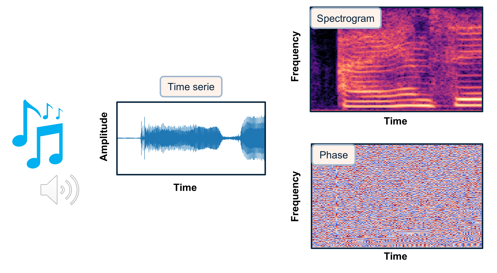
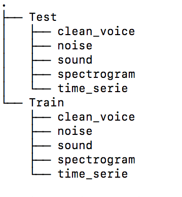
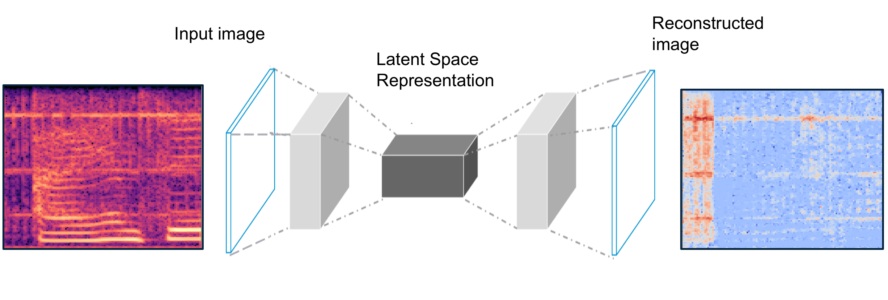
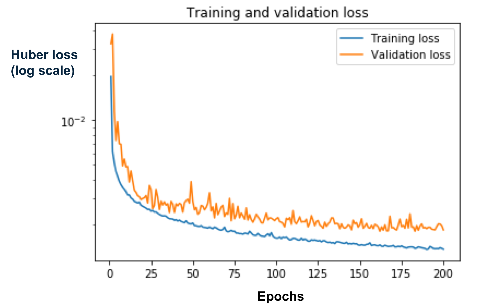
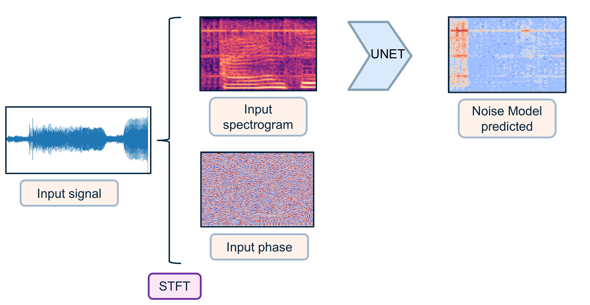
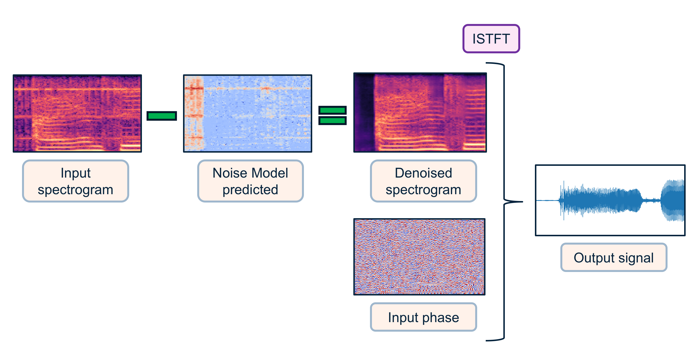
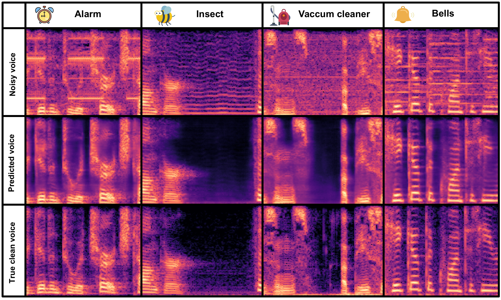
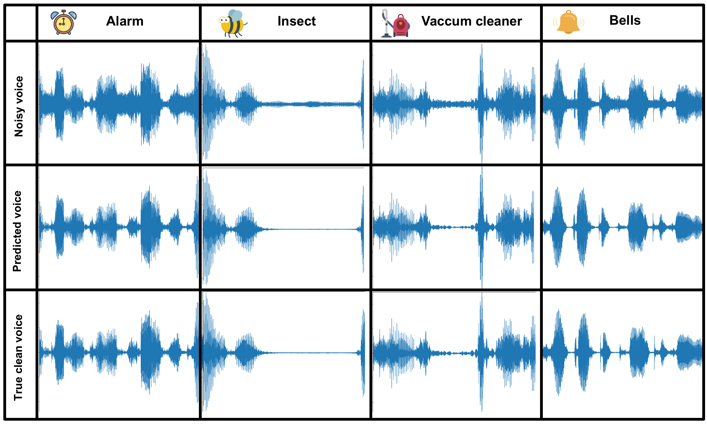

# Speech-enhancement
---
[](https://travis-ci.com/vbelz/Speech-enhancement)
>Vincent Belz : vincent.belz@gmail.com
>
>Published in towards data science : [Speech-enhancement with Deep learning](https://towardsdatascience.com/speech-enhancement-with-deep-learning-36a1991d3d8d)
>
## Introduction
**This project aims at building a speech enhancement system to attenuate environmental noise.**


Audios have many different ways to be represented, going from raw time series to time-frequency decompositions.
The choice of the representation is crucial for the performance of your system.
Among time-frequency decompositions, Spectrograms have been proved to be a useful representation for audio processing. They consist in 2D images representing sequences of Short Time Fourier Transform (STFT) with time and frequency as axes, and brightness representing the strength of a frequency component at each time frame. In such they appear a natural domain to apply the CNNS architectures for images directly to sound. Between magnitude and phase spectrograms, magnitude spectrograms contain most the structure of the signal. Phase spectrograms appear to show only little temporal and spectral regularities.

In this project, I will use magnitude spectrograms as a representation of sound (cf image below) in order to predict the noise model to be subtracted to a noisy voice spectrogram.



The project is decomposed in three modes: `data creation`, `training` and `prediction`.

## Prepare the data

To create the datasets for training, I gathered english speech clean voices  and environmental noises from different sources.

The clean voices were mainly gathered from [LibriSpeech](http://www.openslr.org/12/): an ASR corpus based on public domain audio books. I used as well some datas from [SiSec](https://sisec.inria.fr/sisec-2015/2015-two-channel-mixtures-of-speech-and-real-world-background-noise/).
The environmental noises were gathered from [ESC-50 dataset](https://github.com/karoldvl/ESC-50) or [https://www.ee.columbia.edu/~dpwe/sounds/](https://www.ee.columbia.edu/~dpwe/sounds/).  

 For this project, I focused on 10 classes of environmental noise: **tic clock**, **foot steps**, **bells**, **handsaw**, **alarm**, **fireworks**, **insects**, **brushing teeth**, **vaccum cleaner** and **snoring**. These classes are illustrated in the image below
 (I created this image using pictures from [https://unsplash.com](https://unsplash.com)).


To create the datasets for training/validation/testing, audios were sampled at 8kHz and I extracted windows
slighly above 1 second. I performed some data augmentation for the environmental noises (taking the windows at different times creates different noise windows). Noises have been blended to clean voices  with a randomization of the noise level (between 20% and 80%). At the end, training data consisted of 10h of noisy voice & clean voice,
and validation data of 1h of sound.

To prepare the data, I recommend to create data/Train and data/Test folders in a location separate from your code folder. Then create the following structure as in the image below:



You would modify the `noise_dir`, `voice_dir`, `path_save_spectrogram`, `path_save_time_serie`, and `path_save_sound` paths name accordingly into the `args.py` file that takes the default parameters for the program.

Place your noise audio files into `noise_dir` directory and your clean voice files into `voice_dir`.

Specify how many frames you want to create as `nb_samples` in `args.py` (or pass it as argument from the terminal)
I let nb_samples=50 by default for the demo but for production I would recommend having 40 000 or more.

Then run `python main.py --mode='data_creation'`. This will randomly blend some clean voices from `voice_dir` with some noises from `noise_dir` and save the spectrograms of noisy voices, noises and clean voices to disk as well as complex phases, time series and sounds (for QC or to test other networks). It takes the inputs parameters defined in `args.py`. Parameters for STFT, frame length, hop_length can be modified in `args.py` (or pass it as arguments from the terminal), but with the default parameters each window will be converted into spectrogram matrix of size 128 x 128.

Datasets to be used for training will be magnitude spectrograms of noisy voices and magnitude spectrograms of clean voices.


## Training

The model used for the training is a U-Net, a Deep Convolutional Autoencoder with symmetric skip connections. [U-Net](https://arxiv.org/abs/1505.04597) was initially developed for Bio Medical Image Segmentation. Here the U-Net has been adapted to denoise spectrograms.

As input to the network, the magnitude spectrograms of the noisy voices. As output the Noise to model (noisy voice magnitude spectrogram - clean voice magnitude spectrogram). Both input and output matrix are scaled with a global scaling to be mapped into a distribution between -1 and 1.



Many configurations have been tested during the training. For the preferred configuration the encoder is made of 10 convolutional layers (with LeakyReLU, maxpooling and dropout). The decoder is a symmetric expanding path with skip connections. The last activation layer is a hyperbolic tangent (tanh) to have an output distribution between -1 and 1. For training from scratch the initial random weights where set with He normal initializer.

Model is compiled with Adam optimizer and the loss function used is the Huber loss as a compromise between the L1 and L2 loss.

Training on a modern GPU takes a couple of hours.

If you have a GPU for deep learning computation in your local computer, you can train with:
`python main.py --mode="training"`. It takes as inputs parameters defined in `args.py`. By default it will train from scratch (you can change this by turning `training_from_scratch` to false). You can
start training from pre-trained weights specified in `weights_folder` and `name_model`. I let available `model_unet.h5` with weights from my training in `./weights`. The number of epochs and the batch size for training are specified by `epochs` and `batch_size`. Best weights are automatically saved during training as `model_best.h5`. You can call fit_generator to only load part of the data to disk at training time.

Personally, I used the free GPU available at Google colab for my training. I let a notebook example at
`./colab/Train_denoise.ipynb`. If you have a large available space on your drive, you can load all your training data to your drive and load part of it at training time with the fit_generator option of tensorflow.keras. Personally I had limited space available on my Google drive so I pre-prepared in advanced batches of 5Gb to be loaded to drive for training. Weights were regularly saved and reload for next training.

At the end, I obtained a training loss of 0.002129 and a validation loss of 0.002406. Below a loss graph made in one of the trainings.



## Prediction

For prediction, the noisy voice audios are converted into numpy time series of windows slightly above 1 second. Each time serie is converted into a magnitude spectrogram and a phase spectrogram via STFT transforms. Noisy voice spectrograms are passed into the U-Net network that will predict the noise model for each window (cf graph below). Prediction time for one window once converted to magnitude spectrogram is around 80 ms using classical CPU.



Then the model is subtracted from the noisy voice spectrogram (here I apply a direct subtraction as it was sufficient for my task, we could imagine to train a second network to adapt the noise model, or applying a matching filter such as performed in signal processing). The "denoised" magnitude spectrogram is combined with the initial phase as input for the inverse Short Time Fourier Transform (ISTFT). Our denoised time serie can be then converted to audio (cf graph below).



Let's have a look at the performance on validation datas!

Below I display some results from validation examples for Alarm/Insects/Vaccum cleaner/Bells noise.
For each of them I display the initial noisy voice spectrogram, the denoised spectrogram predicted by the network, and the true clean voice spectrogram. We can see that the network is well able to generalize the noise modelling, and produce a slightly smoothed version of the voice spectrogram, very close to the true clean voice spectrogram.

More examples of spectrogram denoising on validation data are displayed in the initial gif on top of the
repository.



Let's hear the results converted back to sounds:

> Audios for Alarm example:

[Input example alarm](https://vbelz.github.io/Speech-enhancement/demo_data/validation/noisy_voice_alarm39.wav)

[Predicted output example alarm](https://vbelz.github.io/Speech-enhancement/demo_data/validation/voice_pred_alarm39.wav)

[True output example alarm](https://vbelz.github.io/Speech-enhancement/demo_data/validation/voice_alarm39.wav)

> Audios for Insects example:

[Input example insects](https://vbelz.github.io/Speech-enhancement/demo_data/validation/noisy_voice_insect41.wav)

[Predicted output example insects](https://vbelz.github.io/Speech-enhancement/demo_data/validation/voice_pred_insect41.wav)

[True output example insects](https://vbelz.github.io/Speech-enhancement/demo_data/validation/voice_insect41.wav)

> Audios for Vaccum cleaner example:

[Input example vaccum cleaner](https://vbelz.github.io/Speech-enhancement/demo_data/validation/noisy_voice_vaccum35.wav)

[Predicted output example vaccum cleaner](https://vbelz.github.io/Speech-enhancement/demo_data/validation/voice_pred_vaccum35.wav)

[True output example vaccum cleaner](https://vbelz.github.io/Speech-enhancement/demo_data/validation/voice_vaccum35.wav)

> Audios for Bells example:

[Input example bells](https://vbelz.github.io/Speech-enhancement/demo_data/validation/noisy_voice_bells28.wav)

[Predicted output example bells](https://vbelz.github.io/Speech-enhancement/demo_data/validation/voice_pred_bells28.wav)

[True output example bells](https://vbelz.github.io/Speech-enhancement/demo_data/validation/voice_bells28.wav)

Below I show the corresponding displays converting back to time series:



You can have a look at these displays/audios in the jupyter notebook `demo_predictions.ipynb` that I provide in the `./demo_data` folder.

Below, I show the corresponding gif of the spectrogram denoising gif (top of the repository) in the time serie domain.


As an extreme testing, I applied to some voices blended with many noises at a high level.
The network appeared to work surprisingly well for the denoising. The total time to denoise a 5 seconds audio was around 4 seconds (using classical CPU).

Below some examples:

> Example 1:

[Input example test 1](https://vbelz.github.io/Speech-enhancement/demo_data/test/noisy_voice_long_t2.wav)

[Predicted output example test 1](https://vbelz.github.io/Speech-enhancement/demo_data/save_predictions/denoise_t2.wav)

> Example 2:

[Input example test 2](https://vbelz.github.io/Speech-enhancement/demo_data/test/noisy_voice_long_t1.wav)

[Predicted output example test 2](https://vbelz.github.io/Speech-enhancement/demo_data/save_predictions/denoise_t1.wav)

## How to use?

```
- Clone this repository
- pip install -r requirements.txt
- python main.py OPTIONS

* Modes of the program (Possible OPTIONS):

--mode: default='prediction', type=str, choices=['data_creation', 'training', 'prediction']

```

Have a look at possible arguments for each option in `args.py`.

## References

>Jansson, Andreas, Eric J. Humphrey, Nicola Montecchio, Rachel M. Bittner, Aparna Kumar and Tillman Weyde.**Singing Voice Separation with Deep U-Net Convolutional Networks.** *ISMIR* (2017).
>
>[https://ejhumphrey.com/assets/pdf/jansson2017singing.pdf]

>Grais, Emad M. and Plumbley, Mark D., **Single Channel Audio Source Separation using Convolutional Denoising Autoencoders** (2017).
>
>[https://arxiv.org/abs/1703.08019]

>Ronneberger O., Fischer P., Brox T. (2015) **U-Net: Convolutional Networks for Biomedical Image Segmentation**. In: Navab N., Hornegger J., Wells W., Frangi A. (eds) *Medical Image Computing and Computer-Assisted Intervention – MICCAI 2015*. MICCAI 2015. Lecture Notes in Computer Science, vol 9351. Springer, Cham
>
>[https://arxiv.org/abs/1505.04597]

> K. J. Piczak. **ESC: Dataset for Environmental Sound Classification**. *Proceedings of the 23rd Annual ACM Conference on Multimedia*, Brisbane, Australia, 2015.
>
> [DOI: http://dx.doi.org/10.1145/2733373.2806390]

## License

[](http://badges.mit-license.org)

- **[MIT license](http://opensource.org/licenses/mit-license.php)**
